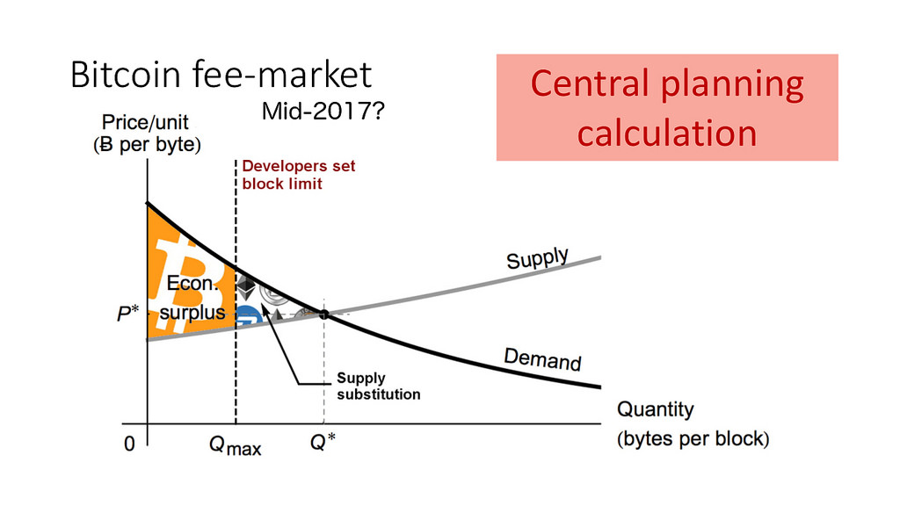
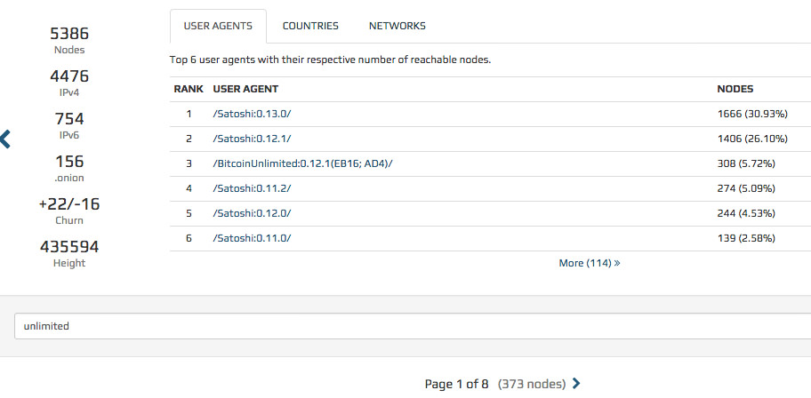

    BUIP034: Ecosystem Outreach for Onchain Scaling
    Proposer: Andrew Clifford (solex)
    Submitted: 2016-10-23
    Status: ??

***Summary***  
  
This is an Operational BUIP requesting BU membership approval of
expenditures necessary to explain the BU vision in particular, and
on-chain scaling goals in general, to decision-makers in as many of the
Bitcoin ecosystem companies as possible. It is assumed that the
full-node network is representative of the ecosystem business community.
Many of these node owners will be receptive to the necessity to restart
Bitcoin's network effect, which has been arrested since mid-2016.
Improving the BU full node count is fundamental to a successful
hard-fork when the hashing-power reaches the region of 75%.  
  
***Background***  
  
Polls taken in the 2013-14 period, during censorship-free times and an
unbiased cryptocurrency news environment showed that business support
for a hard-fork and onchain scaling was running &gt;90%. This support
was higher than polls of users which were usually in the region of
75-85%.  
  
 The existing capacity limit
constraining block-space has created a temporary situation of high fees,
where many users are priced away from Bitcoin.  
  
 This is unstable and market forces
will find a block-space supply substitution. Because of inertia this
does not happen immediately, but likely after a year the process will be
well underway. Fees in Bitcoin transactions will fall back to the
pre-capacity levels seen in 2015, while alternative cryptocurrency gains
a permanent foothold and ecosystem traction.  
  
The conclusion of this process must be averted if Bitcoin is to succeed
in the manner of the original vision.  
  
Since mid-2015 a significant minority of businesses have become resigned
to the prospect of the Bitcoin "farm" being bet on the "roulette wheel"
of 2nd-layer off-chain scaling solutions. To protect their business
model from the likely failure of over-dependency on 2nd-layer solutions
many Bitcoin businesses are transitioning to a multi-cryptocurrency
future, a typical example is Coinbase rebadging its exchange as GDAX and
supporting ETH.  
  
***Ecosystem outreach***  
  
Bitcoin businesses need to be re-awakened to the alternative of
restoring the original vision of supporting onchain scaling up to
technological limits. Also, to see reaffirmation that market-driven
solutions are best. i.e. that 2nd-layer solutions are welcome to compete
for transaction volume with peer-to-peer onchain, but not in an adverse
climate where onchain is crippled in the naive wish that users can be
forced off-chain. Further, that many software improvements exist or will
soon be developed so that Bitcoin transaction-handling capacity is
potentially an order of magnitude larger than that seen today at 3tps.  
  
 At the date of this BUIP submission
the BU node count is 7% of the total (*shown above*), and still climbing
steadily. The principle objective here is to facilitate growth to and
beyond 50%. Importantly, this needs to be organic growth due to many
node owners making an informed choice, and representative of the
ecosystem. There is no economic footprint in multiple nodes on AWS run
by a single person.  
  
Most outreach will be conducted via a combination of written
communication and video-conference discussion.  
  
***Membership participation***  
  
The proposal here is to ask for volunteers from the BU members to help
in the outreach program and personally make a visit to the companies
nearest to them. Their expenses would be covered.  
  
***Expenditure***  
  
Budget: $30,000 over a three-month period commencing from the date of
vote (if successful).  
Commitment of funds will not be made in a cavalier manner, only when it
is apparent that in-person discussions are a clear and necessary
advantage over the usual long-distance communication methods.  
  
***Governance***  
  
The elected BU officials: President, Secretary and Developer will
jointly agree expenditures for outreach initiatives. The details of this
are necessarily incomplete at this point as the process is an evolving
one.
