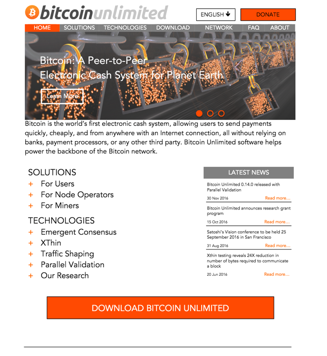

    BUIP035: New Bitcoin Unlimited Website
    Proposer: Peter Rizun (Peter R)
    Submitted: 2016-11-04
    Status: passed

**1. Project Title**  
  
New Bitcoin Unlimited Website  
  
**2. Bitcoin Address**  
  
TBA  
  
**3. Motivation**  
  
The current [*Bitcoin Unlimited (BU)
website*](https://www.bitcoinunlimited.info/) has now served its
purpose. At the time it was created, BU was relatively unknown and the
website helped communicate to enthusiasts that (1) BU adheres to
Satoshi's vision for a peer-to-peer electronic cash system, and (2) that
its members believe that Bitcoin should evolve through a bottom-up
market-based process, rather than by following top-down diktats from
technocrats. With BU's soaring popularity and growing acceptance, it is
now time for a new website targeted at a broader audience, with a
neutral and informational look and feel.  
  
**4. Objectives**  
  
The objective of this project is to build a new Bitcoin Unlimited
website that targets three groups: new users, full-node operators, and
miners. The website will visually explain BU’s central technologies,
have multi-language support, show real-time network statistics on the
emergent block size limit, include an automated BUIP voting system, and
be easier to maintain.  
  
  
[https://www.dropbox.com/s/ykj9ycodaoarf8v/bu\_website\_mockup.pdf?dl=0
''Link to full
mock-up''](https://www.dropbox.com/s/ykj9ycodaoarf8v/bu_website_mockup.pdf?dl=0_''Link_to_full_mock-up'' "wikilink")  
  
**5. Project Duration**  
  
Phase 1: November - December 2016  
  
Phase 2: January - February 2017  
  
Phase 3: March - April 2017  
  
**6. Project Team**  
  
The work will be completed by a joint effort between Bitcoin Unlimited
members and outside paid web developers. The BU members involved include
thezerg, solex, Peter R, digitsu, Trevin Hofmann, sickpig and Jake
Smith. These members will be responsible for keeping the project on
schedule, hiring outside web developers when appropriate, and generating
content.  
  
**7. Summary of Work Completed to Date**  
  
Last winter, Andrew Stone (thezerg) created the first Bitcoin Unlimited
website in Meteor. Trevin Hofmann and Andrew Quentson later re-skinned
the website and added additional content, using the Express JS (Node JS)
platform. The website [*source
code*](https://github.com/BitcoinUnlimited/BitcoinUnlimitedWeb) is
presently hosted on GitHub and is maintained by various members of the
BU team, Trevin Hofmann in particular.  
  
**8. Description of Activities**  
  
A mock-up of the proposed website can be found by following [*this
link*](https://www.dropbox.com/s/ykj9ycodaoarf8v/bu_website_mockup.pdf?dl=0).
Please refer to this mock-up in order to understand the work plan
described below.  
  
*PHASE 1*  
  
Generate missing content (112 hr)

-   Write “solutions” blurbs for users, node operators, miners (8 hr)

-   Prepare tech explainers for emergent consensus, Xthin, parallel
    > validation, traffic shaping, with diagrams/animations as required
    > (56 hr)

-   Sort out content for download page (16 hr)

-   Revise and expand FAQ; organize by visitor category (16 hr)

-   Write brief blurb on BU, collect bios, headshots, pub-keys, etc (16
    > hr)

Skin website (100 hr)

-   Make the site look similar to what’s shown in the mock-up and
    > function as expected

-   Iterate design until fonts, colors, spacing, image sizes, menus look
    > awesome

Create page to dynamically build the “emergent block size limit” charts
(40 hr)

-   Pull data from bitnodes API

Prototype a content-management system (40 hr)

-   So that maintainers can login and post “Recent News” items

*PHASE 2*  
  
Add international support

-   Translate content and graphics to Chinese

-   Translate content and graphics to any other desired languages
    > (depends on volunteers)

-   Get language-select drop-down menu working

Expand “login” functionality on member’s page

-   Members also can login and edit their profiles

-   Maintainers can easily post new software releases

*PHASE 3*  
  
Build automated voting / BUIP management system

-   BUIPs can be submitted for voting using a simple form

-   Members can easily produce digital signatures and submit their votes
    > (e.g., using client-side javascript)

-   System automatically checks signatures and determines if BUIP passes
    > or fails.

-   List of passed BUIPs maintained on website

**9. Anticipated Challenges and Uncertainties**  
  
Most of the work is routine website development, with the exception of
the real-time network statistics graphs and the automated BUIP voting
system.  
  
To build the real-time graphs for the emerging consensus on block size
limit for distribution by nodes, we intend to use the “bitnodes” API
call:
[*<https://bitnodes.21.co/api/v1/snapshots/latest/>*](https://bitnodes.21.co/api/v1/snapshots/latest/).
How we build the equivalent graph for distribution by hash power is not
yet clear, but Andrew Stone has confirmed that the raw data required for
the second graph can be polled directly from a BU full node.  
  
To build the automated BUIP voting system, we intend to use BitPay’s
Bitcore Javascript libraries for signing vote messages client side.
Beyond this, the overall design of the automated voting system is not
yet defined. To de-risk this, Phase III will not commence until a
reasonable plan has been approved by the project team.  
  
The other significant challenge is completing the project on schedule,
as the work plan relies on the contribution of volunteers occurring at a
timely pace. To remove some of this risk, we are asking for funds to
allow some of the “tedious” work to be off-loaded to paid developers.  
  
**10. Budget**  
  
The budget for the project is $30,000, broken down roughly as $15k for
Phase 1, $5k for Phase 2 and $10k for Phase 3. The BU members of the
project team will administer these funds using their discretion. Funds
will be used both to pay outside developers and to pay members for
content creation.  
  
**11. Impact**  
  
By targeting three types of visitors (new users, node operators, and
miners), website visitors will more quickly find the information they
need to make them confident running or supporting Bitcoin Unlimited. New
users will quickly find information the tells them what Bitcoin
Unlimited is and how it supports scaling, using simple visual
explanations. For existing node operators, the site will make it clear
that Bitcoin Unlimited both makes their voice heard and gives them the
best technology (e.g., Xthin and Parallel Validation) for keeping up
with the growing blockchain. Miners will find information that explains
why Bitcoin Unlimited is a safe and efficient way to end the block size
limit debate and move forward with on-chain scaling.
